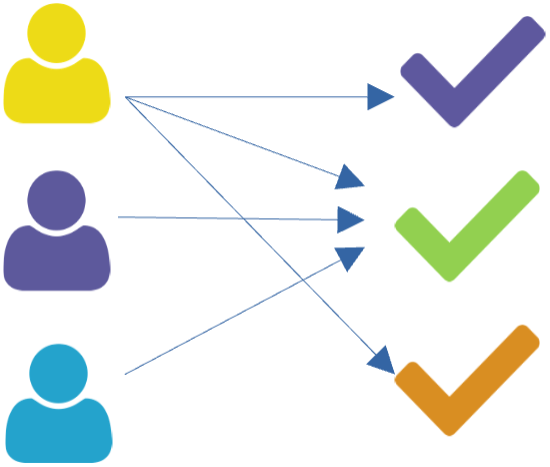
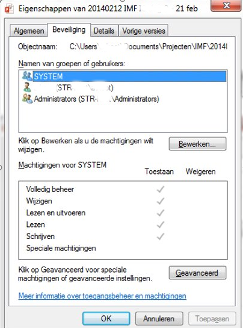
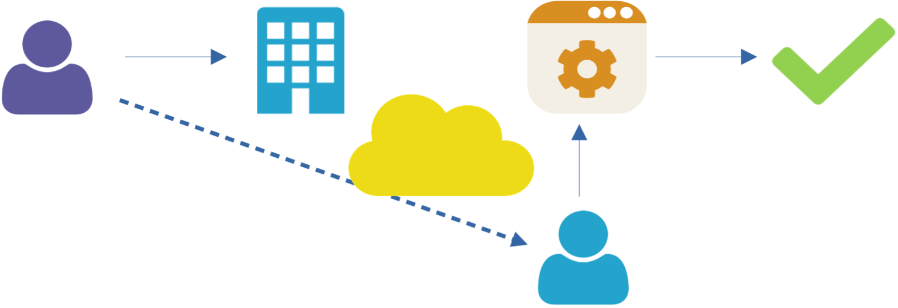
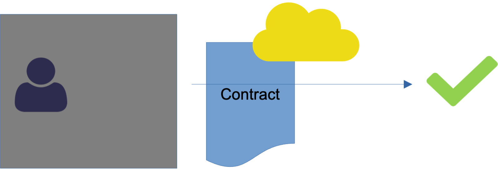
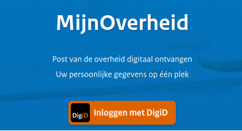

# Introductie tot Toegang en Informatiebeveiliging
In deze introductie worden de verschillende varianten van toegangs- en informatiebeveiliging zoals Attribute-, Role- en Policy Based Access (ABAC, RBAC, PBAC) kort geschetst. Tevens wordt aandacht gegeven aan de governance aspecten die een rol spelen bij de verschillende varianten.

## Uitwerking
“Wie mag wat en waarom is dat zo” is een belangrijke vraag binnen informatiebeveiliging en voor privacybescherming.
Traditioneel wordt dit opgelost door mensen accounts en autorisaties in informatiesystemen te geven. Bijvoorbeeld: een actor krijgt een autorisatie. 

{:width="300px"}

In alle plaatjes in dit document zijn de pijlen feitelijk ‘n:m’ relaties, dat wil zeggen dat een actor meerdere autorisaties kan hebben en dat aan een autorisatie meerdere actoren kunnen zin gekoppeld. Een klein voorbeeld:

{:width="300px"}

Deze methodiek herkennen we in bijvoorbeeld sharepoint: iemand die een document plaatst, mag aangeven wie het document mag lezen of bewerken. Technisch heet dat een Access Control List.

{:width="300px"}

### Role Based Access (RBAC)
Door de groei van de informatieverwerking is het handmatig toekennen en intrekken van afzonderlijke autorisaties aan individuele personen niet meer haalbaar. Voor de vereenvoudiging daarvan wordt gebruik gemaakt van het concept Role Based Access Control (RBAC), waarin iemand een rol krijgt toebedeeld en daarmee de autorisaties die aan de rol zijn gekoppeld automatisch kan gebruiken.

{:width="300px"}

Als iemand anders dezelfde rol gaat vervullen, dan krijgt die persoon automatisch dezelfde autorisaties.

Dat concept heeft lange tijd goed gewerkt, maar er zijn grenzen aan de toepasbaarheid. Een belangrijke randvoorwaarde is dat de individu (de identiteit) en de autorisaties binnen dezelfde context bekend moeten zijn. Zowel de identiteit-rol koppeling als de rol-autorisatie koppeling moeten verklaarbaar zijn: waarom krijgt iemand een rol en waarom zit een autorisatie in een rol.

Het begrip rol kan in het kader van RBAC dus meerdere betekenissen hebben:
* In de relatie medewerker-rol is de rol een kenmerk van de medewerker, namelijk wat is het takenpakket van de medewerker, waar wordt de medewerkers ingezet.
* In de relatie rol-autorisatie is het een groepering van autorisaties die samenhang vertonen met betrekking tot het leveren van toegang tot applicatiefuncties.

Dit maakt ruimte voor een verdere uitbreiding van het RBAC model door de organisatiestructuur en de applicatiestructuur te ontkoppelen. De organisatiestructuur leidt tot bedrijfsrollen en de applicatiestructuur tot applicatierollen. Een bedrijfsrol wordt daarbij gekoppeld aan een applicatierol.

{:width="300px"}

Zolang deze relaties duidelijk zijn, is RBAC prima toepasbaar, al laten we voor het gemak achterliggende governance en compliance vragen even buiten beschouwing.
Momenteel wordt echter in steeds grotere mate gebruik gemaakt van informatiesystemen die door identiteiten vanuit een andere context benaderd worden. Dat betekent dat een koppelingen als identiteit-rol en rol-autorisatie niet meer in één hand zijn en de betekenis van het begrip rol niet meer eenduidig is.

{:width="300px"}

Om dit probleem op te lossen, werd in het verleden een kopie-identiteit (een account) gemaakt binnen de context van het informatiesysteem om de relatie zuiver te houden. Een individu binnen de eigen context kreeg een tweede ‘identiteit’, een account, binnen de context van de applicatie

{:width="300px"}

En dat zorgt voor grote problemen:

Identiteitenbeheer is kostbaar. Instroom, doorstroom en uitstroom zijn processen die volgen op een contractuele relatie tussen de identiteit en de context. Voor de primaire, reguliere context is dat arbeidsrechtelijke, of inhuur, contract. Waarbij instroom gepaard gaat met kwaliteitscontrole, verificatie, screening en wat al niet meer. Dat is meestal een grotendeels handmatig proces. Per saldo is het een kostbaar proces.

In de andere context, die waar informatieverwerking plaatsvindt, moet de identiteit dan ook bekend worden, maar daar vindt, o.a. door beperkingen op grond van wettelijke bepalingen, een ander proces plaats. Echter ook een kostbaar proces, wegens het handwerk, de beheerlast en misschien ook wel licenties etc. Met de bijkomende zorg dat doorstroom en uitstroom niet per definitie aan het arbeidscontract gekoppeld zijn. Identiteitenbeheer is dus kostbaar en vergt uitgebreide beheers- en beveiligingsmaatregelen om de kwaliteit te borgen. Bovendien is het gebruik van functionaliteit van een informatiesysteem ook nog eens een complexe aangelegenheid. Iemand van buiten de context van het systeem heeft wellicht andere behoeften dan iemand van de context zelf.

Hierdoor is schaalbaarheid, naast kosten, een groot probleem.

### Federatie
De oplossing is te vinden in het concept van federatie. Federatie betekent het vertrouwen op identiteiten van derden, Een informatiesysteemeigenaar (de zogenaamde Service Provider of SP, de leverancier van digitale diensten) kan besluiten om te vertrouwen op het identiteitenbeheer van een andere organisatie (de Identity Provider) en kan op basis van een contractuele relatie besluiten om functionaliteit beschikbaar te stellen aan identiteiten van de Identity Provider (ook wel IdP genoemd) van die andere partij. Bezien vanuit de systeemeigenaar is alles binnen de andere contractpartner, inclusief alle beheerde identiteiten, een black box:

{:width="300px"}

Zoals te zien is, wordt er geen nieuwe account gemaakt, de service provider vertrouwt de identiteit van de identity provider en verleent alleen toegang. Er is geen sprake van inloggen, alleen van toegang verkrijgen. Het mag duidelijk zijn dat er in het contract wel concrete afspraken gemaakt moeten worden.

##### Attribute Based Authorisation (ABAC)
Het is niet zo dat iedere individu binnen de black box zomaar alle autorisaties krijgt. In het kader van federatieve toegang worden expliciete toegangsregels contractueel vastgelegd. Kenmerken van de identiteit, de zogenaamde Attributen, bepalen of toegang wordt verstrekt.

Voor deze werkwijze wordt gebruik gemaakt van moderne technologie die het concept van federatie ondersteunt. Dat betekent webtechnologie (websites en webservices, dan wel microservices en APIs) die via moderne protocollen worden ontsloten. Deze protocollen (SAML, OAuth en OpenID Connect) bieden meteen functionaliteit als Single Sign-on, zodat individuen als ze al zijn ingelogd bij hun identity provider, niet nog eens hoeven in te loggen. De service provider hoeft dan ook geen account of wachtwoorden meer te beheren, kan ze ook niet meer kwijtraken en beperkt daarmee direct het risico op datalekken of misbruik of diefstal van digitale identiteiten.

Een voorbeeld:
DigiD is de digitale identiteit van burgers verstrekt door de IdP, in casu DigiD, beheerd door Logius. Met deze digitale identiteit kunnen burgers toegang krijgen bij overheidsdiensten. Een burger die bij een gemeente een vergunning aan wil vragen, logt in bij DigiD en krijgt op grond van het BSN dat als attribuut door DigiD aan de gemeente wordt verstrekt in een SAML-bericht, toegang bij de gemeente.

{:width="300px"}

En als de burger nog niet is ingelogd bij DigiD, zal de mijngemeente.nl website de mogelijkheid bieden om bij DigiD in te loggen.

{:width="300px"}

Er wordt bij mijngemeente.nl geen account en wachtwoord beheerd. Mijngemeente.nl vertrouwt erop dat DigiD het beheer van de identiteit, het wachtwoord en het 06-nummer goed voor elkaar heeft.
Het contract tussen de beide partijen bevat de volgende onderdelen:
* Aansluitvoorwaarden
Welke diensten, voor welk soort gebruikers, privacy en securityvoorwaarden, identiteitenbeheer, audit etc.
* Afspraken en procedures
Incident en change management
* Gegevenscontract
Welke attributen en welke attribuutwaarden zijn toelaatbaar en leiden tot welke toegang, doelbinding (vanuit de AVG), bewaar- en vernietigplicht

#### Policy Based Access (PBAC)
Zoals aangegeven bepaalt het contract dus welk soort toegang toelaatbaar is. Dat impliceert dat zowel de SP als de IdP van elkaar begrijpen welke regels gelden, welk beleid van kracht is. Concreet betekent dit dat de SP op basis van de door de IdP verstrekte gegevens toegang zal verlenen. De SP zal zelf geen identiteiten beheren, maar alleen toegangsregels en de manier waarop iemand toegang kan krijgen.

Deze regels, ook wel Policy genaamd, bepalen feitelijk of toegang wordt verleend. Daarbij maakt niet uit wie het individu is, dat weet de SP namelijk niet, maar wel welke autorisaties, in de vorm van kenmerken, de IdP meegeeft.
In het kader van DigiD geeft DigiD alleen het BSN mee. Het BSN bepaalt of iemand bij een gemeente iets mag doen en wat iemand mag doen.

Belangrijk is dat wel de identiteit als kenmerk wordt meegegeven, want de SP moet wel kunnen laten zien wie waarom toegang heeft gekregen. Voorbeeld:

* Digid BSN heeft op datum(D) om tijd(T) op grond van regel(R)-versieV() toegang gekregen tot Applicatiefunctie(A)

### Zero Trust architectuur
[Zero Trust](https://www.nist.gov/publications/zero-trust-architecture){:target=”_blank” rel=”noopener”} is de moderne invulling van een oud gedachtengoed: laat de data zichzelf beschermen, zodat we geen last hebben van mensen die toegang of autorisaties nodig hebben. De data, of andere resources kennen die mensen niet, dus hoe kunnen ze iemand dan ook toegang verlenen? Het concept van ZTA kent twee hoofdlijnen:

* Netwerkbeveiliging
    * Uitgangspunt onder andere Assume Breach, waarbij netwerk technisch belemmeringen worden opgelegd, zoals isolatie van netwerken, maar ook end-to-end versleuteling.
* Access Control
    * Constante verificatie van de juiste autorisatie van een access requester.
    * Minimale autorisaties

Als we netwerktechnologie buiten beschouwing laten, dan is toegang uitsluitend mogelijk na authenticatie en autorisatie. Maar omdat de menselijke factor geen rol speelt, moet dat worden afgedwongen met Policy Based Access Control. Het gaat er niet om wie wat mag, maar op grond waarvan iemand iets zou moeten mogen. De access control vraag zoals die gold bij de basis toegang en bij RBAC is niet meer mogelijk. Er moet worden gewerkt met access policies.

### Governance
Governance is een cruciaal onderdeel bij het verlenen van toegang. Hoe is te zien wie wat mag of wie wat gedaan heeft?
In het geval van de traditionale toegang, denk aan Access Control Lists, is alleen te zien welke individuen toegang tot een object hebben, zij staan immers in de lijst. Het is niet mogelijk om te zien wat iemand mag want die relatie bestaat alleen vanuit het object, vanuit de ACL.
Bij RBAC is via het toegangspad vanaf de individu weel vast te stellen, per individu is vast te stellen welke autorisaties bestaan en vanuit de autorisaties is af te leiden welke accounts toegang hebben.

* Bijv.: Persoon P met Businessrol X heeft toegang tot Applicatierol Y waarin ApplicatiefunctieZ, of Gegeven Z zijn opgenomen.

En ook kan de lijn terug worden gevonden, wie heeft toegang tot Gegeven Z? Het toegangspad is duidelijk:

* Bijv: gegeven Z of Applicatiefunctie Z is onderdeel van Applicatierol Y, die beschikbaar is voor mensen met Businessrol X. Waaronder persoon P.

In geval van PBAC is niet vast te stellen welke persoon toegang heeft. De IdP beheert immers de identiteiten terwijl de SP alleen de toegang beheert, de identiteiten zitten in de ‘black box’ van de IdP.

Wel is vast te stellen op grond waarvan iemand toegang kan krijgen en op grond van de logging is vast te stellen wie op grond waarvan toegang heeft gehad. Het is dus niet concreet vast te stellen wie nu toegang kunnen hebben, mede doordat in geval van federatie de service provider geen toegang heeft tot de persoonsgegevens van de identity provider. En dat hoeft ook niet meer doordat de service provider toegang biedt op grond van access policies. Access Governance vereist dat elke (deel)eigenaar de toegangsregels expliciet maakt.
