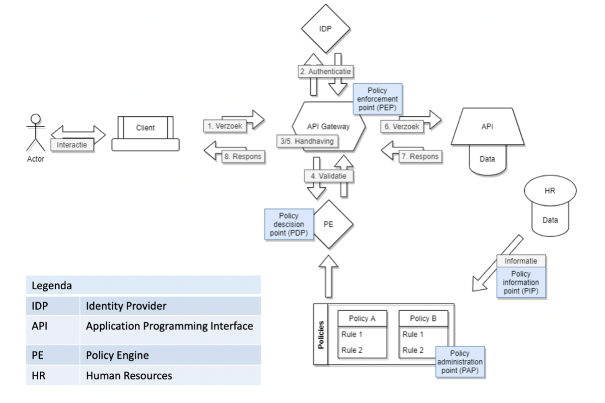

# Referentiearchitectuur werken met API's
Voor het veilig werken met API's wordt een refrentiearchitectuur nagestreeft die gebaseerd is op een zogenaamde 'Zero trust' architectuur. Zero trust is het concept waarbij niets wordt vertrouwt – of het nu binnen of buiten de grenzen van de organisatie gebeurt – zonder eerst te controleren wie en wat verbinding probeert te maken. 

## Uitwerking
Onderstaand figuur schets (een deel van) de referentiearchitectuur die wordt nagestreeft voor het veilig en transparant kunnen werken met API's. Deze referentiearchitectuur is gebaseerd op de principes van een [Zero Trust architectuur](https://www.nist.gov/publications/zero-trust-architecture){:target=”_blank” rel=”noopener”}.

{:width="500px"}

### Korte omschrijving flow.
1.	Gebruiker doet een verzoek naar een API.

2.	Verzoek komt aan bij API Gateway, gebruiker is onbekend en zal worden doorverwezen naar de Identity Provider (IDP) voor authenticatie. Authenticatie kan plaats vinden op basis van:
    * Username/password 
    * Multi-factor
    * Federatieve toegang (SSO)

3.	Aan de hand van uitkomst stap 2 zal de API Gateway handhaven, mag het verzoek wel of niet door (Ja/Nee). De API gateway fungeert hier als Policy Enforcement Point (PEP).

4.	Indien “Ja” bij stap 3 zal aan de hand van het verzoek, kan deze getoetst worden aan een vooraf gedefinieerde policy. Het verzoek zal worden doorgestuurd naar een Policy Engine (PE), welke de relevante policy ophaalt en het verzoek hieraan toetst.

5.	Aan de hand van uitkomst stap 3 zal de API Gateway handhaven, mag het verzoek door Ja/Nee. De API gateway fungeert hier als Policy Enforcement Point (PEP).

6.	Indien “Ja” bij stap 5 zal het verzoek doorgevoerd worden naar de API.

7.	kan deze getoetst worden aan een vooraf gedefinieerde policy. Het verzoek zal worden doorgestuurd naar een Policy Engine (PE), welke de relevante policy ophaalt en het verzoek hieraan toetst. Handhaving vind plaats binnen de API zelf.

8.	Aan de hand van de uitkomst van stap 7, zal de API een respons retourneren aan de API Gateway. Indien “Ja” bij stap 7 zal het verzoek ingewilligd worden en de data geretourneerd worden. Indien “Nee” zal er een foutmelding geretourneerd worden.

9.	De API gateway geeft de respons uit stap 8 door aan de gebruiker. 

Kanttekening: De policies maken onderdeel uit van de Policy Engine.

### Overzicht referentiecomponenten en (markt)oplossingen 
IDP – Identity provider / (Identity broker)
* [Keycloak](https://www.keycloak.org/){:target=”_blank” rel=”noopener”} (Open Source)
* [Authentik](https://goauthentik.io/){:target=”_blank” rel=”noopener”} (Open Source)
* Okta
* Auth0
* Azure AD

PE – Policy engine
* [OPA, Open Policy Agent](https://www.openpolicyagent.org/){:target=”_blank” rel=”noopener”} (Open Source)
* Axiomatics
* PlainID

API Gateway
* [Kong](https://konghq.com/kong/){:target=”_blank” rel=”noopener”} (Open Source)
* [Nginx](https://www.nginx.com/){:target=”_blank” rel=”noopener”} (Open Source)
* Mulesoft
* Axway

